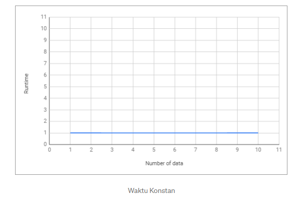
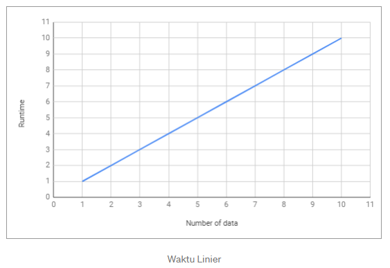
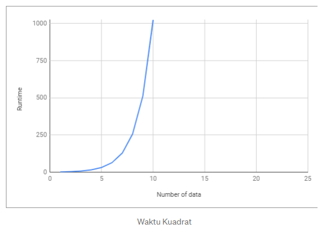
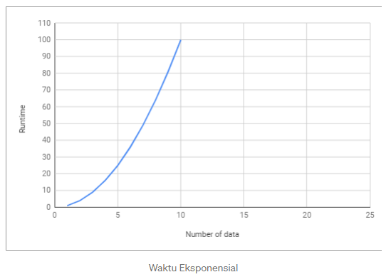

<h1 style="text-align:center;"> Tugas Desain dan Analisis Algoritma</h1>
<h3 style="text-align:center;">
Nama : Ady Mutalib  
NIM : 2110131110003
</h3>

 
<h2 style="text-align:center;"> Penjelasan Sederhana Tentang Kompleksitas Waktu dan Notasi Big-O</h2>

 

 

 
 
 

Setiap programmer yang baik akan menggunakan cara yang paling efektif dan efisien untuk menyelesaikan masalah mereka. Dan untuk melakukan itu, kita harus tahu bagaimana meminimalkan kompleksitas.

Kompleksitas suatu algoritma menjadi 2, yaitu Time Complexity dan Space Complexity .

Kompleksitas Waktu adalah seberapa lama waktu yang dibutuhkan untuk menjalankan suatu algoritma. Sedangkan Space Complexity adalah seberapa besar memori yang kita gunakan untuk menjalankan suatu algoritma. Dan disini kita hanya akan membahas tentang Kompleksitas Waktu .

**Algoritma**

Sebelum kita melanjutkan pembahasan, kita harus memahami dulu apa itu algoritma/fungsi.  
Algoritma adalah proses atau seperangkat aturan yang harus diikuti dalam perhitungan atau operasi pemecahan masalah lainnya, terutama oleh komputer.  

Sederhananya, alkisah adalah proses yang dilakukan secara berurutan untuk menyelesaikan permasalahan. Algoritma bisa bermacam-macam tergantung siapa yang membuat algoritma tersebut. Namun permasalahannya adalah algoritma mana yang lebih efektif dan efisien?  

Seperti halnya yang sering kita hadapi dalam permasalahan sehari-hari, ketika kita akan berpergian ke suatu tempat. Kita tahu ada banyak jalan yang bisa dilalui untuk sampai di tempat tujuan, namun permasalahannya adalah rute mana yang paling cepat yang bisa kita ambil untuk sampai di tempat tujuan?  

Analisis Kompleksitas Waktu adalah suatu cara sederhana untuk mengetahui berapa lama waktu yang dibutuhkan untuk menjalankan suatu algoritma dengan input tertentu (n) . Biasanya lebih dikenal dengan sebutan Notasi Big-O .  

> Big O Notation digunakan untuk mengukur tingkat kerumitan suatu algoritma.

 

**Jadi, Apa itu Notasi Big-O?**

    Notasi Big-O adalah cara untuk mengubah langkah keseluruhan dari suatu algoritme ke dalam suku-suku aljabar, kemudian mengecualikan konstanta dan koefisien orde rendah yang tidak memiliki dampak besar pada kompleksitas masalah secara keseluruhan.

Big-O Notation adalah cara untuk mengkonversi keseluruhan langkah suatu algoritma ke dalam bentuk Aljabar , yaitu dengan konstanta yang lebih kecil dan koefisien yang tidak berdampak besar terhadap kompleksitas permasalahan yang diselesaikan oleh algoritma tersebut.  

Mari kita lihat contoh dibawah ini:

    Big-O Reguler
    2 O(1) --> Ini hanya bilangan konstan
    2n + 10 O(n) --> n memiliki efek terbesar
    5n^2 O(n^2) --> n^2 memiliki efek terbesar

Sederhananya, semua contoh yang ada di atas mengatakan bahwa “ kita hanya akan melihat faktor yang memiliki dampak paling besar terhadap nilai yang dihasilkan oleh algoritma tersebut ”.  

Terdapat beberapa macam kompleksitas waktu , diantaranya:

**O(1) — Waktu Konstan**

    O(1) — Waktu Konstan: Diberikan input berukuran n, hanya dibutuhkan satu langkah algoritma untuk menyelesaikan tugas.

Constant Time artinya banyaknya input yang diberikan kepada suatu algoritma, tidak akan mempengaruhi waktu proses ( runtime ) dari algoritma tersebut.

    biarkan myArray = [1, 5, 0, 6, 1, 9, 9, 2]; 
    fungsi getFirst(masukan){
    kembali masukan[0]; // selalu melakukan 1 langkah
    }
    biarkan firstEl = getFirst(myArray);

Contoh diatas, terdapat sebuah fungsi untuk mengambil elemen pertama dari sebuah array input. Kita bisa melihat bahwa berapapun jumlah array yang diberikan kepada fungsi tersebut, dia akan selalu melakukan 1 hal, yaitu mengambil elemen pertama. Itu artinya jumlah input yang diberikan tidak mempengaruhi waktu proses ( runtime ) dari algoritma tersebut .  

 

 
 

**O(log n) — Waktu Logaritma**

    O(log n) — Waktu logaritmik: diberi input berukuran n, jumlah langkah yang diperlukan untuk menyelesaikan tugas dikurangi beberapa faktor dengan setiap langkah.

Logarithmic Time artinya ketika kita memberikan input nterhadap sebuah fungsi, jumlah tahapan yang dilakukan oleh fungsi tersebut berkurang berdasarkan suatu faktor. Salah satu contohnya adalah algoritma Binary Search .  

Binary Search adalah algoritma yang kita gunakan dalam mencari posisi dari suatu array dengan cara 'mengeliminasi' setengah dari array input untuk mempercepat proses pencarian.  

    biarkan sortArray = [11, 24, 30, 43, 51, 61, 73, 86]; 
    function isExists(angka, larik){
        var midPoint = Math.floor( array.length /2 );
        if( array[midPoint] === num) mengembalikan nilai true;
        biarkan isFirstHalf = salah;
        if( array[midPoint] < num ) isFirstHalf = true; 
    
        else if( array[titik tengah] > num ) isFirstHalf = false;
        if (array.length == 1) mengembalikan false;
        kalau tidak {
            // memanggil fungsi yang sama dengan mengeleminiasi setengah dari input array
            if (isFirstHalf) 
                mengembalikan isExists(angka, getFirstHalf(array)); 
            lain 
                kembalikan isExists(angka, getSecondHalf(array));
        }
    }
    isExists (24, sortArray); // kembalikan benar
    isExists (27, sortArray); // kembalikan salah

> Catatan: Fungsi rekursif biasanya Logaritma.

**O(n) — Waktu Linier**

    O(n) — Waktu Linier: Diberikan input berukuran n, jumlah langkah yang diperlukan berhubungan langsung (1 hingga 1)

Linear Time adalah ketika runtime dari fungsi kita berbanding lurus dengan jumlah input yang diberikan.

    biarkan myArray = [1, 5, 0, 6, 1, 9, 9, 2]; 
    fungsi getMax(masukan){ 
        var max = 0;
        untuk (var i=0; i<input.length; i++){
            if (maks < masukan[i]) 
                maks = masukan[i];
        } 
        kembalikan maks;
    }
    biarkan maxNumber = getMax(myArray);

Kita bisa melihat bahwa semakin banyak jumlah input yang diberikan, maka waktu proses/ runtime dari fungsi tersebut akan semakin besar .  

 

 
 

**O(n²) — Waktu Kuadrat**

    O(n²) — Waktu Kuadrat: Diberikan input berukuran n, jumlah langkah yang diperlukan untuk menyelesaikan tugas adalah kuadrat n.

Quadratic Time adalah ketika runtime dari fungsi kita adalah sebesar n^2, dimana nadalah input dari fungsi tersebut. Hal tersebut dapat terjadi karena kita menjalankan fungsi linear didalam fungsi linear (n*n).

    biarkan myArray = [1, 5, 0, 6, 1, 9, 9, 2]; 
    function sort(input){ 
        var sortArray = [];
        for (var i=0; i<input.length; i++){ // O(n)
            misalkan min = masukan[i];
            for (var j=i+1; i<input.length; i++){ // O(n)
                if (masukan[i] < masukan[j]) 
                    min = masukan[j];
            }
            sortArray.push(min);
        }
        kembali sortArray;
    }
    biarkan sortArray = sort(myArray);

 

 
 

**O(2^n) — Waktu Eksponensial**

    O(2^n) — Waktu Eksponensial: Diberikan input berukuran n, jumlah langkah yang diperlukan untuk menyelesaikan tugas adalah konstan terhadap pangkat n (angka yang cukup besar).

Waktu Eksponensial biasanya digunakan dalam situasi dimana kita tidak terlalu mengetahui permasalahan yang dihadapi, sehingga kita harus mencoba setiap kombinasi dan permutasi dari semua kemungkinan.  

 

 
 

**Kesimpulan**

Sebagai programmer , kita sering kali dihadapkan dengan adanya beberapa solusi untuk sebuah permasalahan dan kita dibingungkan dengan pertanyaan “ mana solusi yang lebih efisien? ”.  

Dengan memahami Notasi Big-O , kita akan lebih mudah dalam melihat mana algoritma yang lebih efisien yang bisa kita gunakan untuk menyelesaikan permasalahan yang sedang dihadapi.  

Dengan memahami Notasi Big-O , kita akan lebih mudah dalam melihat mana algoritma yang lebih efisien yang bisa kita gunakan untuk menyelesaikan permasalahan yang sedang dihadapi.  

Referensi berikut yang dapat digunakan untuk mempelajari lebih lanjut tentang Notasi Big-O :  

- Kamp Kode Gratis: Waktu itu rumit tetapi tak ternilai harganya
- Notasi Big-O dalam 5 menit — Dasar-dasarnya
- Pengantar Notasi O Besar dan Kompleksitas Waktu Artikel lain yang mungkin ingin Anda baca:
- Cara Kerja Algoritma k-Nearest Neighbor (k-NN)

